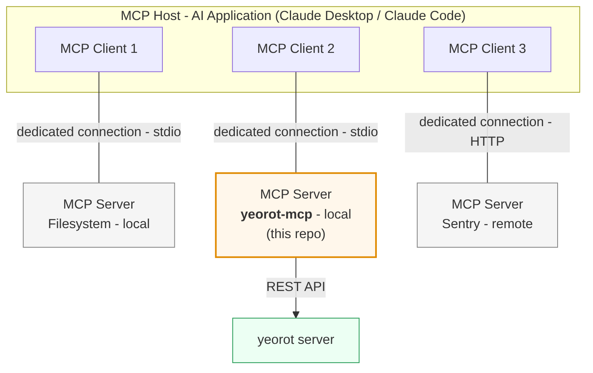
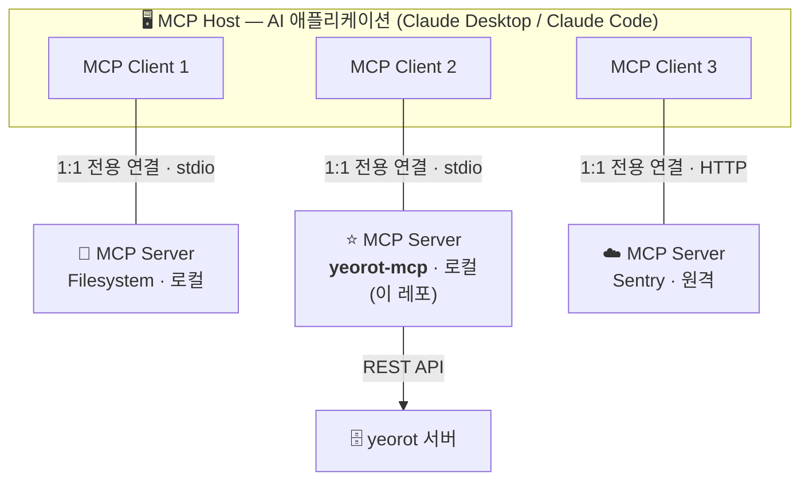
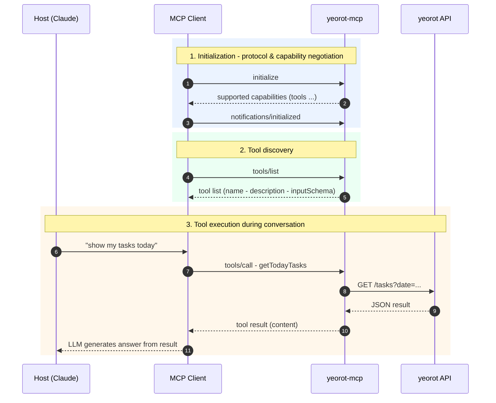
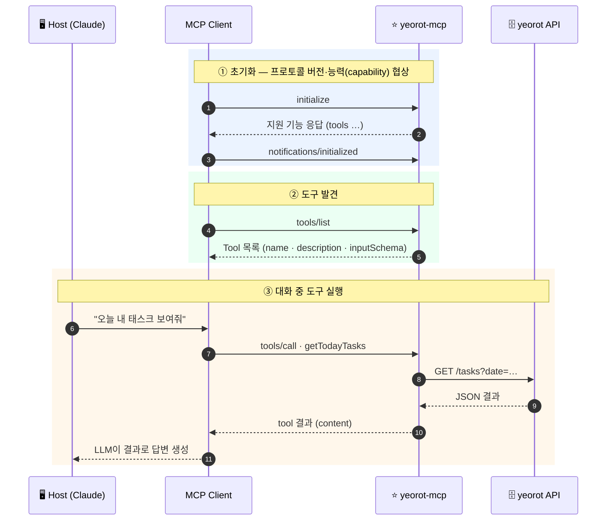

# yeorot-mcp

[yeorot](https://github.com/waryongc/yeorot) REST API를 Claude(AI)가 직접 호출할 수 있도록 감싼 **MCP(Model Context Protocol) 서버**입니다.

사용자가 말로 yeorot을 조작할 수 있게 해주는 Claude ↔ yeorot 중간 레이어.

---

## 목차

- [MCP란?](#mcp란)
- [등록된 Tool 목록](#등록된-tool-목록)
- [프로젝트 구조](#프로젝트-구조)
- [환경 변수](#환경-변수)
- [로컬 실행](#로컬-실행)
- [원격 서버로 연결하기 (추천)](#원격-서버로-연결하기-추천)
- [Claude Desktop 연결 설정 (로컬 stdio)](#claude-desktop-연결-설정-로컬-stdio)
- [인스톨러 앱](#인스톨러-앱)
- [Tool 추가 방법](#tool-추가-방법)
- [기술 스택](#기술-스택)

---

## MCP란?

**MCP(Model Context Protocol)** 는 Anthropic이 주도하는 오픈 표준으로, AI 애플리케이션이 외부 도구·데이터 소스와 **JSON-RPC 2.0** 기반으로 표준화된 방식으로 소통할 수 있게 합니다. USB-C가 기기 연결 규격을 통일하듯, MCP는 "AI ↔ 외부 시스템" 연결 방식을 하나의 프로토콜로 통일합니다. 플러그인처럼 MCP 서버를 연결하면 AI가 직접 API 호출·DB 조회·파일 조작 등을 수행할 수 있습니다.

> 이 절은 [MCP 공식 아키텍처 문서](https://modelcontextprotocol.io/docs/learn/architecture)를 기준으로 작성했습니다.

### 참여자: Host · Client · Server

MCP는 클라이언트-서버 구조입니다. **Host**(AI 앱)가 연결할 서버마다 **Client**를 하나씩 만들고, 각 Client는 자신의 **Server**와 **1:1 전용 연결**을 유지합니다. 하나의 Host가 여러 서버에 동시에 붙을 수 있습니다.

<p align="center">
  
</p>

<details>
<summary>다이어그램 소스 (Mermaid · GitHub에서 직접 렌더링)</summary>



</details>

| 참여자 | 역할 | 이 프로젝트에서 |
|---|---|---|
| **MCP Host** | 여러 Client를 조율·관리하는 AI 앱 | Claude Desktop / Claude Code |
| **MCP Client** | 서버 1개와 전용 연결을 유지하는 컴포넌트 | Host 내부에 서버마다 1개씩 |
| **MCP Server** | 도구·데이터(컨텍스트)를 제공하는 프로그램 | **이 레포 (yeorot-mcp)** |

> 로컬 서버(stdio)는 보통 Client 1개를 상대하고, 원격 서버(HTTP)는 여러 Client를 상대합니다. yeorot-mcp는 Host가 자식 프로세스로 띄우는 **로컬 stdio 서버**입니다.

### 2계층 구조: 데이터 레이어 + 전송 레이어

| 레이어 | 역할 | yeorot-mcp |
|---|---|---|
| **데이터 레이어** (안쪽) | JSON-RPC 2.0 기반 프로토콜 — 라이프사이클·프리미티브·알림 정의 | 공통 |
| **전송 레이어** (바깥쪽) | 실제 통신 채널 — 연결 수립·메시지 프레이밍·인증 | **stdio** (원격 서버는 Streamable HTTP) |

전송 레이어가 통신 방식을 추상화하므로, stdio든 HTTP든 **동일한 JSON-RPC 2.0 메시지**가 오갑니다.

### 동작 방식: 초기화 → 발견 → 실행

Host가 서버를 자식 프로세스로 spawn한 뒤, 아래 순서로 통신합니다.

<p align="center">
  
</p>

<details>
<summary>다이어그램 소스 (Mermaid · GitHub에서 직접 렌더링)</summary>



</details>

서버의 도구 목록이 바뀌면 서버가 `notifications/tools/list_changed` 알림을 보내고, Client는 `tools/list`로 목록을 새로 받습니다(실시간 동기화).

### 프리미티브 — 서버와 클라이언트가 서로 제공하는 것

**서버가 노출하는** 3가지:

| 프리미티브 | 설명 | yeorot-mcp |
|---|---|---|
| **Tools** | AI가 호출하는 실행 함수 (API·DB·파일 조작) | ✅ 사용 (9개 Tool 등록) |
| **Resources** | AI가 읽는 컨텍스트 데이터 (파일·DB 레코드 등) | — 미사용 |
| **Prompts** | 재사용 가능한 프롬프트 템플릿 (시스템 프롬프트·few-shot 등) | — 미사용 |

**클라이언트가 노출하는** 것(서버가 더 풍부한 상호작용을 만들 때 사용): **Sampling**(서버가 Host의 LLM에 완성을 요청 — 서버가 모델 SDK 없이도 LLM 사용), **Elicitation**(서버가 사용자에게 추가 입력·확인 요청), **Logging**(서버가 디버그 로그 전송).

이 둘과 별개로, 요청 실행 방식을 보강하는 **공통 유틸리티 프리미티브**도 있습니다: **Notifications**(실시간 업데이트 — 예: `tools/list_changed`)와 **Tasks**(실험적 — 오래 걸리는 요청을 내구성 있게 실행하고 나중에 결과·상태를 조회).

이 서버는 **Tools만** 사용합니다. Claude가 대화 중 필요하다고 판단하면 `tools/call`로 호출하고, 서버가 yeorot REST API를 실행한 뒤 결과를 반환합니다.

### 전송: Stdio + Streamable HTTP

yeorot-mcp는 두 가지 전송을 지원합니다.

**로컬 stdio 서버** (`src/index.ts`) — MCP Host가 이 프로세스를 자식 프로세스로 spawn하고, 표준 입출력으로 JSON-RPC 메시지를 주고받습니다.

- `stdin`  ◀── JSON-RPC 요청 수신 (`initialize` / `tools/list` / `tools/call`)
- `stdout` ──▶ JSON-RPC 응답 송신 (tool 결과)
- `stderr` ──▶ 로그 출력 (디버깅용 — **AI 응답에 노출되지 않음.** 그래서 API 키·내부 URL·에러는 stderr로만 출력)

**원격 Streamable HTTP 서버** (`src/server-http.ts`) — `https://mcp.yeorot.cloud/mcp`로 운영 중입니다. 여러 사용자가 동시에 접속하며, 요청별 인증(OAuth 토큰 또는 API 키)을 AsyncLocalStorage로 격리합니다. 연결 방법은 [원격 서버로 연결하기](#원격-서버로-연결하기-추천), 설계는 [docs/remote-server-plan.md](docs/remote-server-plan.md)를 참고하세요.

---

## 등록된 Tool 목록

| Tool | 설명 | 주요 파라미터 |
|---|---|---|
| `getTodayTasks` | 날짜별 태스크 조회 | `date` (선택, YYYY-MM-DD), `scope` (mine/team) |
| `createTask` | 새 태스크 생성 | `title` (필수), `planned_date`, `priority`, `due_time` 등 |
| `updateTaskStatus` | 태스크 상태·진행률·제목·날짜·우선순위 등 변경 | `id` (UUID), `status`, `progress`, `title`, `priority`, `planned_date` 등 |
| `getRackStatus` | 서버 랙 현황 조회 | `rack_id` (선택, UUID) |
| `getProjectStatus` | 프로젝트 현황·진행률·멤버 기여도 조회 | `project_id` (선택, UUID), `include_tasks` |
| `searchTasks` | 키워드로 태스크·프로젝트 검색 | `q` (필수, 검색 키워드 2자 이상) |
| `getStats` | 기간별 생산성 통계 조회 | `period` (day/week/month), `date`, `from`, `to` |
| `deleteTask` | 태스크 삭제 (소프트 삭제) | `id` (필수, UUID) |
| `moveTask` | 태스크 계획 날짜 이동 | `id` (필수, UUID), `planned_date` (필수, YYYY-MM-DD) |

---

## 프로젝트 구조

```
yeorot-mcp/
├── src/
│   ├── index.ts              # stdio 진입점 — 로컬 단일 사용자
│   ├── server-http.ts        # Streamable HTTP 진입점 — 원격 멀티유저 (mcp.yeorot.cloud)
│   ├── auth-context.ts       # AsyncLocalStorage — 요청별 인증 키 격리
│   ├── register-tools.ts     # 도구 등록 (stdio·HTTP 공유)
│   ├── config.ts             # 환경변수 검증 (Zod)
│   ├── client.ts             # yeorot API HTTP 클라이언트
│   ├── dates.ts              # KST 날짜 유틸
│   ├── update.ts             # 업데이트 체크 (GitHub Releases, 24시간 캐시)
│   ├── version.ts            # 현재 버전 상수
│   └── tools/
│       ├── getTodayTasks.ts      # 날짜별 태스크 조회
│       ├── createTask.ts         # 태스크 생성
│       ├── updateTaskStatus.ts   # 태스크 상태·진행률 변경
│       ├── getRackStatus.ts      # 서버 랙 현황 조회
│       ├── getProjectStatus.ts   # 프로젝트 현황 조회
│       ├── searchTasks.ts        # 키워드 검색
│       ├── getStats.ts           # 기간별 생산성 통계
│       ├── deleteTask.ts         # 태스크 삭제 (소프트)
│       └── moveTask.ts           # 태스크 날짜 이동
├── installer/                # Electron GUI 설치 프로그램
│   ├── src/
│   └── package.json
├── dist/                     # 빌드 결과물
│   ├── index.js              # tsc 컴파일 결과
│   └── bundle.mjs            # esbuild ESM 번들 (인스톨러용)
├── .github/workflows/
│   └── build-installer.yml   # 태그 푸시 → 자동 빌드 & GitHub Release
├── Dockerfile                # 원격 HTTP 서버 컨테이너 (멀티스테이지)
├── .env.example
├── package.json
└── tsconfig.json
```

---

## 환경 변수

`.env.example` 파일을 복사해서 사용하세요.

| 변수 | 필수 | 기본값 | 설명 |
|---|---|---|---|
| `YEOROT_API_URL` | ✅ | — | yeorot 서버 주소 (예: `https://yeorot.cloud/api/v1`) |
| `YEOROT_API_KEY` | stdio만 ✅ | — | API 키 (`yrk_` 접두사 필수). HTTP 모드는 요청별 Bearer 인증을 쓰므로 불필요 |
| `TZ` | | `Asia/Seoul` | 타임존 |
| `YEOROT_TIMEOUT_MS` | | `10000` | 요청 타임아웃 (ms) |
| `PORT` | | `3000` | HTTP 모드 포트 (`npm run start:http`) |
| `MCP_ALLOWED_HOSTS` | HTTP 배포 시 ✅ | localhost | DNS rebinding 보호용 허용 Host 목록 (콤마 구분) |
| `MCP_ALLOWED_ORIGINS` | | — | 허용 Origin 목록 (콤마 구분, 브라우저 클라이언트 대비) |
| `MCP_RESOURCE_URL` | OAuth 사용 시 ✅ | — | RFC 9728 PRM의 resource 식별자 (예: `https://mcp.yeorot.cloud/mcp`) |
| `MCP_AUTH_SERVER_URL` | OAuth 사용 시 ✅ | — | 인가 서버(onl1d) 주소 — PRM `authorization_servers`에 노출 |

---

## 로컬 실행

```bash
# 1. 환경 변수 설정
cp .env.example .env
# .env에 실제 값 입력

# 2. 의존성 설치
npm install

# 3. 개발 모드 실행 (tsx 직접 실행)
npm run dev

# 또는 빌드 후 실행
npm run build && npm start
```

---

## 원격 서버로 연결하기 (추천)

설치 없이 URL 하나로 연결합니다. 서버 주소: **`https://mcp.yeorot.cloud/mcp`**

### 방법 A — 원클릭 로그인 (claude.ai · Claude Desktop · 모바일)

1. claude.ai → **설정(Settings) → 커넥터(Connectors) → 커스텀 커넥터 추가(Add custom connector)**
2. URL에 `https://mcp.yeorot.cloud/mcp` 입력 후 추가
3. **연결(Connect)** 클릭 → yeorot SSO 로그인 창이 뜨면 본인 계정으로 로그인
4. 끝 — 새 대화에서 커넥터를 켜고 "오늘 내 태스크 보여줘"처럼 말하면 됩니다

API 키 발급·복사가 필요 없고, 한 번 연결하면 같은 계정의 웹·데스크톱·모바일 어디서든 사용됩니다. (커스텀 커넥터는 Pro/Max/Team/Enterprise 플랜에서 사용 가능)

### 방법 B — Claude Code

```bash
# OAuth 로그인 방식 (추천)
claude mcp add --transport http yeorot https://mcp.yeorot.cloud/mcp
# 이후 Claude Code 세션에서 /mcp → yeorot 선택 → Authenticate → 브라우저 로그인

# 또는 API 키 방식 (헤드리스/스크립트 환경)
claude mcp add --transport http yeorot https://mcp.yeorot.cloud/mcp \
  --header "Authorization: Bearer yrk_발급받은키"
```

> 로그인 대신 yeorot에서 발급한 API 키(`yrk_` 접두사)를 Bearer 헤더로 직접 전달할 수도 있습니다. 토큰이 만료되면 세션이 401로 끊겼다가 클라이언트가 자동으로 재연결합니다.

---

## Claude Desktop 연결 설정 (로컬 stdio)

> 원격 서버 연결(위)이 더 간단합니다. 로컬 stdio 방식은 오프라인 환경이나 직접 빌드해 쓰고 싶은 경우에 사용하세요.

### 사전 준비

- [Node.js 18+](https://nodejs.org) 설치
- [Claude Desktop](https://claude.ai/download) 설치
- yeorot API 키 발급 (`yrk_` 로 시작)

> **참고:** 더블클릭만으로 끝나는 [인스톨러 앱](#인스톨러-앱)을 쓰면 아래 수동 설정은 필요 없습니다.

### 1단계: 레포 클론 & 빌드

```bash
git clone https://github.com/waryongc/mcp.git yeorot-mcp
cd yeorot-mcp
npm install
npm run build
# dist/index.js 생성됨
```

### 2단계: 빌드된 파일 경로 확인

```bash
# macOS / Linux
pwd
# 예: /Users/ji.park/yeorot-mcp  →  dist/index.js 경로는 /Users/ji.park/yeorot-mcp/dist/index.js

# Windows (CMD)
cd
# 예: C:\Users\ji.park\yeorot-mcp  →  경로는 C:\\Users\\ji.park\\yeorot-mcp\\dist\\index.js
```

### 3단계: 설정 파일 열기

**macOS**

```bash
open ~/Library/Application\ Support/Claude/
```

**Windows** — `Win+R` → 실행창에 입력:

```
%APPDATA%\Claude
```

`claude_desktop_config.json`을 텍스트 편집기로 엽니다.

> **새 Claude Desktop(스토어/MSIX 버전) 사용 시:** `%APPDATA%`가 가상화되어 위 클래식 경로 대신
> `%LOCALAPPDATA%\Packages\Claude_*\LocalCache\Roaming\Claude\claude_desktop_config.json` 에서 config를 읽습니다.
> 설정 → 개발자 → "로컬 MCP 서버" → **구성 편집** 버튼을 누르면 앱이 실제로 읽는 파일이 바로 열립니다.
> 자세한 배경은 [docs/postmortem-한글경로-mcp-설치.md](docs/postmortem-한글경로-mcp-설치.md) 참고.

### 4단계: 설정 추가

> **파일에 기존 내용이 있는 경우:** 기존 내용을 지우지 말고 `"mcpServers"` 키만 추가합니다.

```json
{
  "mcpServers": {
    "yeorot": {
      "command": "node",
      "args": ["/Users/ji.park/yeorot-mcp/dist/index.js"],
      "env": {
        "YEOROT_API_URL": "https://yeorot.cloud/api/v1",
        "YEOROT_API_KEY": "yrk_발급받은키입력"
      }
    }
  }
}
```

Windows 경로는 역슬래시를 두 개(`\\`)로 작성합니다:

```json
"args": ["C:\\Users\\ji.park\\yeorot-mcp\\dist\\index.js"]
```

### 5단계: Claude Desktop 재시작

설정 파일 저장 후 Claude Desktop을 완전히 종료(트레이 → Quit)하고 다시 시작합니다.
Chat 탭에서 `yeorot` 도구가 표시되면 연결 성공입니다. (Code 탭은 이 config를 읽지 않으므로 별도 등록 필요)

---

## 인스톨러 앱

더블클릭 한 번으로 설치를 완료하는 **Electron GUI 설치 프로그램**입니다.
API 키만 입력하면 MCP 서버 파일 복사 + Claude Desktop 설정까지 자동으로 처리합니다. 클래식·MSIX 패키지 앱의 config 경로를 모두 자동으로 찾아 씁니다.

### 다운로드

[GitHub Releases](https://github.com/waryongc/mcp/releases) 페이지에서 OS별 설치 파일을 받습니다.

| OS | 파일 |
|---|---|
| macOS | `.dmg` |
| Windows | `.exe` |
| Linux | `.AppImage` |

### 릴리즈 방법 (개발자용)

```bash
git tag installer-v0.x.0
git push origin installer-v0.x.0
# GitHub Actions가 자동으로 빌드 & Release 생성
```

---

## Tool 추가 방법

1. `src/tools/새도구.ts` 생성:

```typescript
import { z } from 'zod';
import { yeorotFetch } from '../client.js';

const InputSchema = z.object({ /* ... */ });

export const myTool = {
  name: 'myTool',
  description: 'AI가 이 도구의 용도를 판단하는 기준 설명',
  inputSchema: {
    type: 'object' as const,
    properties: { /* JSON Schema */ },
    required: [],
  },
  async execute(rawInput: unknown) {
    const parsed = InputSchema.safeParse(rawInput);
    if (!parsed.success) throw new Error(parsed.error.errors[0]?.message ?? '입력값 오류');
    return yeorotFetch('/your-endpoint');
  },
};
```

2. `src/index.ts`에 import 후 `server.tool(...)` 등록
3. `npm run build` 로 컴파일 확인
4. `PROGRESS.md` 업데이트

yeorot 백엔드 API가 이미 있으면 MCP 쪽만 작업하면 됩니다.

---

## 기술 스택

| 영역 | 기술 | 설명 |
|---|---|---|
| 언어 | TypeScript (ESM) | 정적 타입 + ES Module 방식 |
| 런타임 | Node.js 18+ | 서버 실행 환경 |
| MCP SDK | `@modelcontextprotocol/sdk` | MCP 프로토콜 구현체 — JSON-RPC 처리·도구 등록·stdio 전송을 대신 해줌 |
| 입력 검증 | Zod | AI가 넘긴 도구 입력값을 런타임에 검증 |
| 환경 변수 | dotenv | `.env` 파일을 `process.env`로 로드 |
| 번들러 | esbuild | 소스를 단일 `.mjs`로 묶어 인스톨러에 포함 |

### 각 기술 자세히

#### `@modelcontextprotocol/sdk` — MCP SDK

Anthropic이 공식 제공하는 **MCP 프로토콜 구현 라이브러리**입니다. MCP는 [JSON-RPC 2.0](https://www.jsonrpc.org/) 기반 프로토콜이라, 원래대로면 `initialize` 핸드셰이크, `tools/list`·`tools/call` 메시지 파싱, stdio 메시지 프레이밍 등을 직접 구현해야 합니다. SDK가 이 저수준 작업을 전부 대신해주므로, 우리는 `server.tool(name, description, schema, handler)` 한 줄로 도구를 등록하고 비즈니스 로직(yeorot API 호출)에만 집중하면 됩니다. 이 레포에서는 `src/index.ts`에서 `McpServer`와 `StdioServerTransport`를 사용합니다.

#### Zod — 런타임 입력 검증

TypeScript의 타입은 **컴파일 시점에만** 존재하고 빌드 후엔 사라집니다. 그런데 도구 입력값은 **AI(Claude)가 런타임에 만들어 보내는** 값이라, 타입만으로는 "정말 그 형태로 왔는지" 보장할 수 없습니다. Zod는 스키마를 코드로 정의해 **실행 중에** 입력을 검사하고, 통과하면 타입까지 좁혀줍니다. 예: `날짜는 YYYY-MM-DD 형식`, `진행률은 0~100`. 잘못된 입력은 도구 실행 전에 한국어 에러로 막습니다 (`InputSchema.safeParse(...)` 패턴).

#### dotenv — 환경 변수 로딩

`YEOROT_API_URL`·`YEOROT_API_KEY` 같은 설정값을 **코드에 하드코딩하지 않고** `.env` 파일에 두기 위한 라이브러리입니다. 실행 시 `.env`를 읽어 `process.env`에 채워넣어, 같은 코드로 개발/운영 환경의 다른 값을 쓸 수 있고 API 키를 git에 커밋하지 않을 수 있습니다 (`.env`는 `.gitignore` 대상). 참고로 인스톨러로 설치된 경우엔 Claude Desktop config의 `env` 항목이 값을 직접 주입하므로 `.env` 없이도 동작합니다.

#### esbuild — 번들러

여러 `.ts`·`node_modules` 의존성으로 흩어진 소스를 **하나의 실행 파일(`dist/bundle.mjs`)로 묶어주는** 초고속 번들러입니다. 인스톨러 앱이 이 단일 파일 하나만 `~/.yeorot-mcp/index.mjs`로 복사하면 되도록 만들기 위해 사용합니다 (`npm run bundle`). `node_modules` 폴더를 통째로 배포할 필요가 없어 설치가 가볍고 빨라집니다. 참고로 일반 빌드(`npm run build`)는 번들 없이 `tsc`로 컴파일만 합니다.
